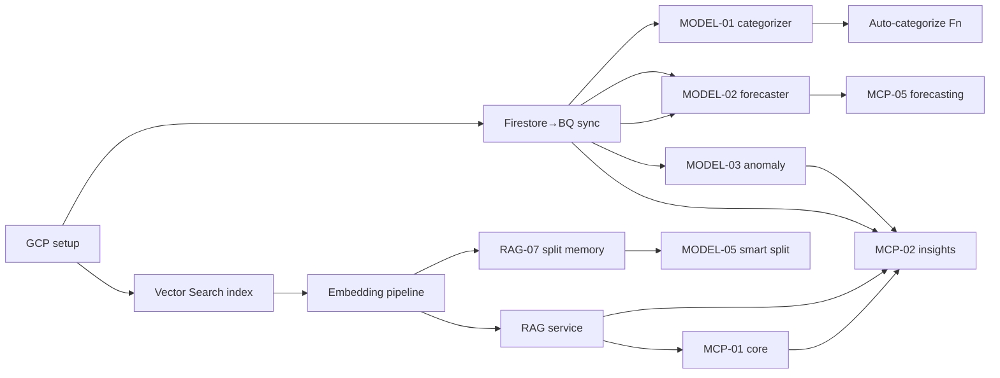

# Phase 3 — Brainstorm & Prioritization

> Full catalog of RAG pipelines, MCP servers, and Vertex AI models for SplitCircle,
> then a priority matrix and a dependency-aware build order. Every idea is anchored to
> the real entities from Phase 1 (embedded `groups.expenses[]`, free-form `category`,
> 11 split methods, `minimizeDebts`, etc.).

---

## 1. RAG Pipeline Catalog

> **Index strategy for all pipelines:** one Vertex AI Vector Search index, namespaced by
> `userId` (and `groupId`) via `restricts` metadata — a user can **never** retrieve another
> user's vectors (Critical Rule #2). One expense ≈ one chunk (records are tiny).

### RAG-01 — Personal Expense Memory  🟢
- **Source:** all expenses where `me ∈ participants[].userId` OR `me == paidBy`, across groups.
- **Embed:** `"{title} · {category} · {currency}{amount} · {date} · with {participantNames} · {notes}"`.
- **Index:** Vertex Vector Search, `restricts: [{namespace:'user', allow:[uid]}]`.
- **Queries:** "Did I pay for dinner last time we met?", "what did I spend at REI?"
- **User value:** instant recall of personal spend. **Group value:** resolves "who paid?" disputes.

### RAG-02 — Group Expense Intelligence  🟢
- **Source:** `groups/{gid}.expenses[]` for groups the user belongs to.
- **Embed:** expense text + `groupName` + participant context.
- **Index:** same index, `restricts: [{namespace:'group', allow:[gid]}]` + membership check.
- **Queries:** "what has our group spent most on across all trips?", "food this trip?"
- **User value:** trip/group totals in NL. **Group value:** shared source of truth.

### RAG-03 — Receipt Knowledge Base  🔵
- **Source:** `expense.splitMetadata.receiptItems[]` + `receipt` + parsed merchant text.
- **Embed:** line-item names + merchant + date (multimodal optional for the image).
- **Queries:** "what was on that restaurant bill from Bali?"
- **Depends on:** Document AI / existing `parseReceiptWithLLM` output being persisted.

### RAG-04 — Financial Pattern Library  🔵
- **Source:** **derived** monthly per-user summaries (BQ table `monthly_user_summary`).
- **Embed:** `"{userId} {YYYY-MM}: total {x}, top {cat} {y}, vs prior {delta}"`.
- **Queries:** "is my spending this month normal for me?" → retrieves comparable months.

### RAG-05 — Settlement History RAG  🟡
- **Source:** `groups.settlements[]` + timing.
- **Embed:** `"{from}→{to} {amount} on {date}, {daysToSettle}d after request"`.
- **Queries:** "has Alex paid me back reliably?" (pairs well with MODEL-04).

### RAG-06 — Group Activity Narrative  🔵
- **Source:** synthesized activity log (expense/settlement/member events reconstructed from
  group diffs — note: there's **no stored activity feed today**, §5 dependency).
- **Embed:** event sentences.
- **Queries:** "catch me up on what happened in this group."

### RAG-07 — Split-Method Memory *(new — leverages the 11-method differentiator)*  🟢
- **Source:** historical `splitMetadata.method` + participant configs per (group, payer).
- **Queries (powers MODEL-05):** "split this like we usually do for rent" → recall last
  `timeBased`/`shares` config. **No competitor can do this** — it's unique to SplitCircle's model.

### RAG-08 — Policy / Help RAG *(new — support deflection)*  🟡
- **Source:** in-repo docs (`README`, `ARCHITECTURE.md`, `CALLING_SETUP.md`).
- **Queries:** "how do I start a group call?" Embeds product docs, not user PII.

---

## 2. MCP Server Catalog

> All tools: zod-validated inputs, uid taken from the **auth token** (never trusted from
> args), group membership enforced, outputs sanitized. Write tools flagged for human-in-loop.

### MCP-01 — `splitcircle-core`  🟢 (BUILD FIRST)
**Purpose:** core CRUD + settlement for an AI assistant to read/act on SplitCircle data.

| Tool | Input | Output | Notes |
|---|---|---|---|
| `get_expenses` | `{groupId?, limit?, dateRange?, category?}` | `expense[]` | uid scoped; reads embedded array |
| `get_group_balances` | `{groupId}` | `{balances:[{userId,net,owes,isOwed}]}` | reuses `calculateBalancesFromExpenses` |
| `add_expense` | `{groupId, title, amount, paidBy, participants, splitType, category, date?, notes?}` | `{expenseId, expense}` | **write — confirm**; idempotent via `requestId` |
| `search_expenses` | `{query, groupId?, limit?}` | `{results[], answer}` | delegates to RAG service |
| `get_settlement_suggestions` | `{groupId}` | `{settlements:[{from,to,amount}]}` | reuses `minimizeDebts` |
| `get_user_groups` | `{}` | `group[]` + balance summary | uid from token |
| `get_recent_activity` | `{groupId?, limit?}` | `activity[]` | reconstructed from diffs |

- **Resources:** `splitcircle://user/{uid}/expenses`, `splitcircle://group/{gid}/summary`, `splitcircle://group/{gid}/balances`.
- **Prompts:** `analyze_my_spending`, `settle_up`, `review_expense`.

### MCP-02 — `splitcircle-insights`  🟢 (BUILD SECOND)
**Purpose:** spending intelligence over history (BigQuery + Gemini).

| Tool | Input | Output |
|---|---|---|
| `get_spending_summary` | `{period, groupId?}` | `{total, byCategory, trend, topExpenses}` |
| `compare_spending_periods` | `{period1, period2}` | `{delta, deltaPercent, categoryBreakdown, insight}` |
| `find_unusual_expenses` | `{lookbackDays?=30}` | `{anomalies:[{expense, reason, score}]}` |
| `ask_about_spending` | `{question, groupId?}` | `{answer, sources}` (RAG) |
| `get_group_contribution_analysis` | `{groupId}` | `{members:[{userId, totalPaid, totalOwed, fairShare, delta}]}` |
| `get_top_categories` | `{period, groupId?}` | `{categories:[{name, total, pct}]}` |
| `get_split_fairness_score` | `{groupId}` | `{score, perMember}` *(new)* |

### MCP-03 — `splitcircle-receipts`  🔵
Tools: `process_receipt_image`, `extract_line_items`, `suggest_split_from_receipt`,
`attach_receipt_to_expense`, `ocr_receipt`. Wraps Document AI + existing `parseReceiptWithLLM`
+ `computeItemized`.

### MCP-04 — `splitcircle-groups`  🔵
Tools: `get_group_summary`, `get_group_spending_timeline`, `suggest_settlement_plan`
(NL-explained `minimizeDebts`), `get_member_contribution_analysis`, `generate_trip_report`.

### MCP-05 — `splitcircle-forecasting`  🔵
Tools: `forecast_next_month_spending` (ARIMA_PLUS), `get_budget_status`,
`predict_settlement_date` (MODEL-04), `estimate_trip_budget` (MODEL-06).

### MCP-06 — `splitcircle-notifications`  🟡
Tools: `get_overdue_settlements`, `get_pending_approvals`, `get_expense_anomalies`,
`get_group_activity_digest`. Powers proactive nudges; reuses anomaly model + diff logic.

### MCP-07 — `splitcircle-admin` *(new — ops/analytics, internal)*  🟡
Tools: `get_cohort_metrics`, `get_model_health`, `get_rag_eval_scores`. Internal-only, separate IAM.

---

## 3. Vertex AI Model Catalog

| ID | Model | Type | Service | Training data | Inference in → out | Value |
|---|---|---|---|---|---|---|
| **MODEL-01** 🟢 | Expense Category Classifier | Multi-class | **BigQuery ML** `LOGISTIC_REG` | `expenses` w/ non-null `category`, 365d | `{title, amount, hour, dow}` → category + confidence | Zero-effort categorization (the table-stakes win) |
| **MODEL-02** 🔵 | Monthly Spending Forecaster | Time-series | BQML `ARIMA_PLUS` | per-user monthly totals (≥6 mo) | history → next-month by category | "On track to overspend on food" |
| **MODEL-03** 🟢 | Expense Anomaly Detector | Anomaly | BQML `KMEANS`/`ARIMA_PLUS` detect, or statistical z-score | per-user category baselines | expense → score + reason | Fraud/duplicate/outlier flag at entry |
| **MODEL-04** 🔵 | Settlement Behavior Predictor | Classification | BQML `LOGISTIC_REG` | settlement timing per pair | pair+amount → P(settle ≤7/14/30d) | Smart reminders, reliability score |
| **MODEL-05** 🔵 | Smart Split Recommender | Recommendation | Heuristic + RAG-07 (no training v1) | historical `splitMetadata` | context → method + per-member amounts | "Split like last time" (unique) |
| **MODEL-06** 🟡 | Trip Budget Optimizer | Regression | BQML `LINEAR_REG` | past trips (group+duration) | dest/size/days → budget by category | Pre-trip budgeting |
| **MODEL-07** 🟢 *(new)* | Embedding model wiring | Embedding | Vertex `text-embedding-005` | n/a (managed) | text → 768-dim | Powers all RAG |

**Why MODEL-01/03/07 are the green set:** they need only data we already have (or trivially
derive), serve via `BQ PREDICT`/managed API (no endpoint to babysit), and map to the
highest-frequency journeys (add expense, query spend).

---

## 4. Priority Matrix (Impact × Complexity)

```
                    HIGH IMPACT
                        │
  🔵 STRATEGIC BETS     │     🟢 QUICK WINS
  - RAG-02 group intel  │  - MODEL-01 categorizer
  - MODEL-02 forecaster │  - MODEL-07 embeddings
  - MODEL-04 settle pred│  - MODEL-03 anomaly (statistical v1)
  - splitcircle-groups  │  - RAG-01 personal memory
  - splitcircle-receipts│  - RAG-07 split-method memory
  - MODEL-05 smart split│  - splitcircle-core (MCP-01)
  - RAG-03 receipts KB  │  - splitcircle-insights (MCP-02)
HIGH ───────────────────┼─────────────────── LOW   (complexity)
COMPLEXITY              │
  🔴 DEPRIORITIZE       │     🟡 NICE TO HAVE
  - RAG-06 narrative*   │  - RAG-05 settlement RAG
    (*needs activity    │  - RAG-08 help RAG
     feed first)        │  - MODEL-06 trip budget
  - splitcircle-admin   │  - splitcircle-notifications
    (low user impact)   │  - get_split_fairness_score
                        │
                    LOW IMPACT
```

---

## 5. Recommended Build Order (Top 10)

1. **GCP foundation** — APIs, IAM, BQ dataset, GCS bucket, secrets (`gcp_setup.sh`).
2. **Firestore→BigQuery sync** — unnest `groups.expenses[]` (the §5 correction) + backfill.
3. **MODEL-07 embeddings + Vector Search index** (`index_config.json`).
4. **Embedding pipeline** (RAG-01/02) — trigger on `groups/{gid}` updates.
5. **RAG query service** (`queryExpenseRAG`) — embed→search→retrieve→Gemini-ground.
6. **MCP-01 `splitcircle-core`** — wraps balances/settlements/RAG; deployable to Cloud Run.
7. **MODEL-01 category classifier** (BQML) + auto-categorize write-back Function.
8. **MODEL-03 anomaly** (statistical v1 in BQ) — feeds `find_unusual_expenses`.
9. **MCP-02 `splitcircle-insights`** — BQ aggregations + RAG + Gemini insight.
10. **RAG-07 split-method memory** → **MODEL-05 smart split** (the differentiator).

---

## 6. Dependency Map



**Hard prerequisites:** nothing RAG works without `IDX`+`EMB`; no BQML model works without
`SYNC`; `MCP-02` is thin without `SYNC`+`RAG`. Build the spine (GCP→SYNC→IDX→EMB→RAG) first.

*Phase 3 complete. Proceeding to Phase 4 architecture.*
