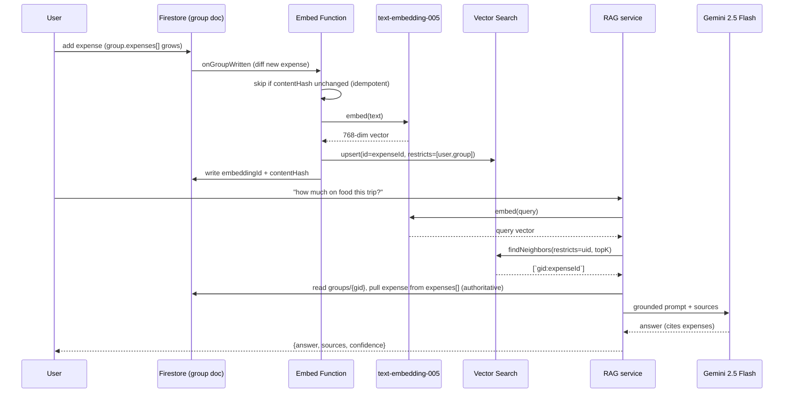

# Phase 4 — Architecture Design

> Full technical design for the SplitCircle AI intelligence layer on GCP / Vertex AI.
> Reflects the Phase 1 reality that **expenses are embedded in `groups/{groupId}.expenses[]`**
> (not a flat `/expenses` collection), so triggers and sync unnest the array.

---

## 1. System Architecture (overview)

```mermaid
flowchart TB
  subgraph App["📱 SplitCircle App (RN/Expo)"]
    A1[Add/edit expense]
    A2[AI chat / search]
  end

  subgraph Existing["Existing Firebase"]
    FS[(Firestore<br/>groups{expenses,settlements})]
    AUTH[Firebase Auth]
  end

  subgraph Ingest["AI Ingestion (Cloud Functions v2)"]
    T1[onGroupWritten → unnest expenses]
    SYNC[BQ sync: stream rows]
    EMBED[Embed pipeline: text-embedding-005]
  end

  subgraph Stores["AI Stores"]
    BQ[(BigQuery splitcircle_ml)]
    VS[(Vertex AI Vector Search<br/>namespaced by user/group)]
  end

  subgraph Serve["AI Serving (Cloud Run)"]
    RAG[RAG service: queryExpenseRAG]
    MCP1[MCP splitcircle-core]
    MCP2[MCP splitcircle-insights]
  end

  subgraph Models["Vertex / BQML"]
    GEM[Gemini 2.5 Flash]
    M1[BQML category classifier]
    M3[BQML/statistical anomaly]
  end

  A1 --> FS
  FS --> T1
  T1 --> SYNC --> BQ
  T1 --> EMBED --> VS
  A2 --> MCP1
  A2 --> MCP2
  MCP1 --> RAG
  MCP2 --> RAG
  MCP2 --> BQ
  RAG --> VS
  RAG --> FS
  RAG --> GEM
  BQ --> M1 --> FS
  BQ --> M3 --> MCP2
  MCP1 -.OAuth2.1 / verify ID token.-> AUTH
  MCP2 -.verify ID token.-> AUTH
```

---

## 2. RAG Pipeline Design

**Data flow (corrected for embedded arrays):**
```
groups/{gid} write (Function trigger)
  → diff & unnest expenses[]  →  per-expense:
       ├─ map → BigQuery row (streaming insert)         [analytics]
       └─ build embed text → text-embedding-005 (768d)
              → upsert to Vertex Vector Search
                 (datapoint id = `${gid}:${expenseId}` — the gid is required to
                  hydrate an expense that lives EMBEDDED in the group doc,
                  restricts: user=[participantUids], group=[gid])
              → write embeddingId + contentHash back to expense [reverse lookup + idempotency]
```

**Query pipeline (`queryExpenseRAG`):**
1. Embed query (`text-embedding-005`, **same model as ingestion** — Finding 3).
2. Vector Search `findNeighbors` with `restricts` = authenticated `uid` (+ optional `groupId`),
   `approximateNeighborsCount` tuned for latency, `topK` default 10.
3. Hydrate top-K from Firestore by **parsing `${gid}:${expenseId}` from each datapoint id**,
   reading `groups/{gid}` and pulling the expense out of the embedded `expenses[]` array
   (authoritative values; vectors can lag). An expenseId alone is *not* addressable — this is
   the embedded-array reality (Finding 1) reaching all the way into the query path.
4. Apply post-filters (date/category/amount) the index didn't cover.
5. Build grounded context (`context_builder`) + system prompt (`prompt_templates`).
6. Generate with **Gemini 2.5 Flash** (cost rule #4), grounded, citations required.
7. Return `{answer, sources[], confidence, generationMetadata}`.

| Decision | Choice | Rationale |
|---|---|---|
| Index update | **Streaming upsert** on group write (near-real-time) + nightly batch reconcile | matches Vertex streaming guidance; expenses must be searchable immediately |
| Embedding model | `text-embedding-005` (768-dim); **use `gemini-embedding-001` if non-English usage is material** | 005 is English-optimized — SplitCircle is multi-currency/international, so a multilingual model may improve recall on non-English titles/notes. Both behind the `EMBEDDING_MODEL` constant (768 dims retained), so it's a config swap |
| Chunking | **1 expense = 1 datapoint** | records are tiny (Finding 4) |
| Security boundary | `restricts` namespace = userId | Critical Rule #2; enforced again at hydration via Firestore rules / membership |
| Caching | Cloud Memorystore (Redis) keyed by `hash(query+uid+filters)`, TTL 1h | repeated "this month?" queries |
| Latency target | p95 < **1.8 s** end-to-end (embed ~80ms + search ~50ms + hydrate ~150ms + Gemini Flash ~1.2s) | Cloud Run min-instances=1, index autoscaling |

---

### Ingestion trigger fan-out (one trigger, not three)

Three concerns key off `groups/{groupId}` writes — **BQ sync**, **embedding**, and
**auto-categorize**. Registering three independent `onDocumentWritten('groups/{groupId}')`
Functions means 3× invocations per write, and auto-categorize *writes back* to the group doc,
re-firing all three. To keep this bounded and cheap:

- **Consolidate** into one `onGroupWritten` orchestrator that calls sync + embed + categorize
  in sequence (this is the single "light app hook" to export from `functions/src/index.ts`).
- Every branch is **idempotent** (sync/embed keyed by `contentHash`; categorize skips
  non-blank categories), so the write-back re-fire is a guaranteed no-op — the loop
  **self-terminates after one extra fire**, it is not infinite.
- The shipped code keeps the branches as separate modules for testability; wiring them behind
  one trigger is the integration step (Sprint 1) and is intentionally deferred until the plan
  is confirmed.

## 3. Vertex AI Model Pipeline (top 3: MODEL-07, MODEL-01, MODEL-03)

```
Firestore(groups.expenses[]) ──unnest──► BigQuery splitcircle_ml.expenses (raw)
   │
   ├─ SQL feature views (create_training_data.sql)
   │      e.g. title, amount, hour_of_day, day_of_week, label=category
   │
   ├─ TRAIN  CREATE MODEL splitcircle_ml.expense_category_classifier (LOGISTIC_REG)
   ├─ EVAL   ML.EVALUATE  → accuracy / log_loss gate (≥0.80 to promote)
   ├─ SERVE  ML.PREDICT (in-warehouse — no endpoint)
   │           ▲ called from predict_service.ts (Cloud Function on expense create)
   │           └─ write category back to Firestore ONLY if user left it blank (rule #5 idempotent)
   └─ MONITOR  Vertex Model Monitoring + scheduled ML.EVALUATE on fresh slice; alert on drift
   RETRAIN  Cloud Scheduler weekly (retrain_scheduler.yaml)
```
- **MODEL-07 (embeddings):** managed, no training — just the index + `EMBEDDING_MODEL` constant.
- **MODEL-03 (anomaly) v1:** pure SQL z-score over per-user/category mean+stddev (ship same
  sprint as classifier); v2 upgrades to `ML.DETECT_ANOMALIES` on `ARIMA_PLUS`.
- **Serving choice:** **BQML `ML.PREDICT` over a Vertex endpoint** — cheaper, no infra to run,
  and category/anomaly are batch-friendly. Reserve Vertex Endpoints for future low-latency models.

---

## 4. MCP Server Architecture

| Aspect | Decision |
|---|---|
| Runtime | **Cloud Run** (autoscaling, scale-to-zero), one service per server |
| Transport | **Streamable HTTP** (remote, 2025-06-18 spec) + stdio entry for local dev |
| Auth | OAuth 2.1 Resource Server **+** Firebase **ID-token** verification middleware; `uid` derived from token, **never** from tool args |
| Authorization | every tool re-checks group membership against Firestore before reading/writing |
| Data access | Firestore **Admin SDK** via dedicated service account (least privilege) |
| Validation | `zod` schemas → JSON Schema for `inputSchema`; outputs sanitized |
| Rate limiting | per-uid token bucket in middleware (+ Cloud Armor / API Gateway at the edge) |
| Secrets | Secret Manager (`GEMINI_API_KEY`, service-account creds via ADC) |
| Observability | structured logs (no PII), per-tool latency + token-usage metrics |

**Per-server skeleton (`src/index.ts`):**
```
createServer()
  → register tools (one module each, exporting {definition, handler})
  → register resources (URI templates)
  → register prompts
  → wrap handlers: authMiddleware(token→uid) → zod.parse(args) → membershipCheck → handler → sanitize
  → StreamableHTTPServerTransport (Cloud Run) | StdioServerTransport (local)
```
Tool definition shape follows the spec: `{ name, title, description, inputSchema, outputSchema?, annotations:{readOnlyHint|destructiveHint} }`. `add_expense` carries `destructiveHint:false, idempotentHint:true` and is flagged for client human-confirmation.

---

## 5. GCP Infrastructure Plan

**APIs to enable:** `aiplatform`, `bigquery`, `bigqueryconnection`, `run`, `cloudfunctions`,
`documentai`, `secretmanager`, `cloudscheduler`, `pubsub`, `redis`, `storage`,
`eventarc`, `logging`, `monitoring`.

**Service accounts (least privilege):**
| SA | Roles |
|---|---|
| `sc-mcp@` (MCP servers) | `datastore.viewer` (+ scoped writer for `add_expense`), `aiplatform.user`, `bigquery.dataViewer`, `bigquery.jobUser`, `secretmanager.secretAccessor` |
| `sc-pipeline@` (BQML/train) | `bigquery.dataEditor`, `bigquery.jobUser`, `aiplatform.user` |
| `sc-embed@` (embedding fn) | `datastore.user`, `aiplatform.user`, `storage.objectAdmin` (staging) |

**Key resources:** Vector Search index `sc-expense-memory` (768d, dot-product, streaming);
BQ dataset `splitcircle_ml`; Cloud Run `splitcircle-mcp-core`, `splitcircle-mcp-insights`;
GCS `gs://<project>-splitcircle-ml-artifacts`; Memorystore `sc-rag-cache`; secrets
`GEMINI_API_KEY`, `MCP_SHARED_SECRET`. Provisioned by `setup/gcp_setup.sh` (idempotent gcloud).

---

## 6. Data Flow: Firestore → Embeddings → Vector Search → Generation



---

## 7. Security & Compliance Notes

- **PII fields** (from Phase 1): `email`, `displayName`, `phoneNumber`, expense `title`,
  `notes`, receipt item names. → Embedding text **excludes** email/phone; logs **never**
  include expense text (Critical Rule #3).
- **Per-user isolation:** Vector Search `restricts` by uid **and** Firestore-side membership
  re-check at hydration — defense in depth (Critical Rule #2).
- **BQ export minimization:** raw `notes` optionally **redacted** (DLP) before warehouse load;
  analytics need amounts/categories, not free text.
- **Idempotency** (Critical Rule #5): embed/sync keyed by `contentHash`; triggers can fire
  multiple times — re-processing is a no-op.
- **Data residency:** pin Vertex + BQ + Cloud Run to one region (e.g. `us-central1`); document
  for GDPR/right-to-erasure (deleting an expense must delete its vector + BQ row — handled by
  the delete branch of the sync/embed Functions).
- **Token-usage logging** per RAG query for cost attribution (Critical Rule #4).

*Phase 4 complete. Proceeding to Phase 5 master plan.*
